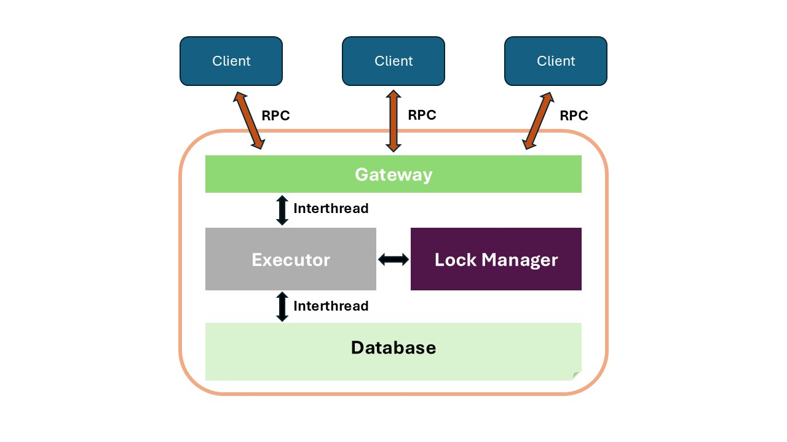
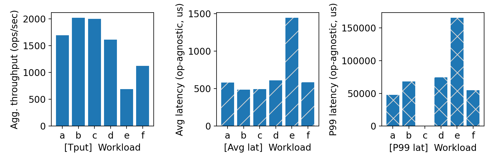
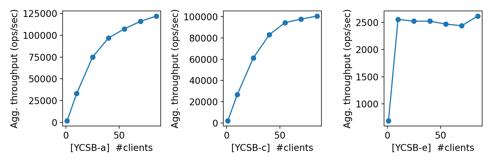
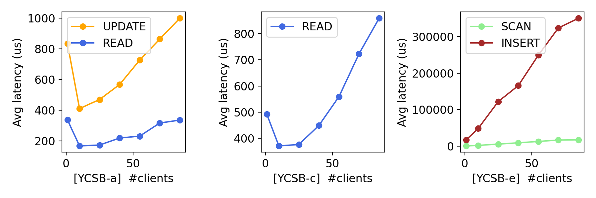

# CS 739 MadKV Project 1

**Group members**: Qianliang Wu `qwu293@wisc.edu`, Zhenghong Yu `zyu379@wisc.edu`

## 1 Design Walkthrough

### 1.1 Code Structure

```bash
├── common/           # Shared utilities and types
│   ├── id.rs         # ID generation/management
│   ├── lib.rs        # Common library exports
│   └── session.rs    # Client session abstraction

├── rpc/              # RPC/Network communication layer
│   ├── proto/    
│   │   └── gateway.proto  # RPC service definitions
│   └── lib.rs       

├── server/           # Server implementation
│   └── src/
│       ├── database.rs     # Core KV store implementation
│       ├── executor.rs     # Command execution logic
│       ├── gateway.rs      # RPC service interface
│       ├── lock_manager.rs # Concurrency control
│       └── main.rs      

├── client/           # Terminal interaction 
│   └── src/
│       └── main.rs  

├── benchmark/        # Stdin/out interaction
    └── src/
        └── main.rs  
```



### 1.2 Client

The client component establishes and maintains communication with the server's gateway via remote procedure calls (RPC). The client constructs multi-operation commands and reliably transmits them to the server-side executor. The client also handles retries and error notifications, ensuring robust interaction during transient failures.

### 1.3 Server

The server has a modular component collection that processes and executes KV commands. These components include the Gateway, Executor, Lock Manager, and Database.

#### 1.3.1 Gateway

The gateway serves as the initial contact point for all incoming RPC requests. It establishes a client connection and forwards the command result stream to the executor component. By decoupling connection management from command execution, the gateway ensures the system can efficiently handle a high volume of concurrent client connections.

#### 1.3.2 Executor

Upon receiving a forwarded connection from the gateway, the executor spawns dedicated worker threads to manage client-specific command streams. 

Each worker thread listens to incoming KV operations and executes the pipeline. This pipeline involves calculating each command's read and write sets, interacting with the lock manager to acquire the necessary locks, executing the operations against the underlying database, and releasing the locks. 

The executor also consolidates the results of the executed operations and transmits the final response back to the client. 

#### 1.3.3 Lock Manager

The lock manager controls concurrency by implementing a wound-wait locking mechanism. 

When a worker thread requests locks for a given command, the lock manager determines whether it can be granted immediate access or must wait due to conflicts. In cases of conflict, younger transactions (i.e., those with higher command IDs) may be aborted to favor older transactions, thereby ensuring serializability and avoiding deadlocks. 

Once a command completes execution or is aborted, the lock manager releases the corresponding locks and promotes waiting commands if applicable.

#### 1.3.4 Database

The database module has the core key-value store functionality. Currently, the database uses an in-memory B-tree as the data structure. Notably, the database operates independently of the locking mechanism; it assumes that the executor has already coordinated lock acquisition.

### 1.4 RPC protocol

Clients establish a bidirectional streaming connection with server using `ConnectExecutor`.

Client send `Command` to Server, which contains a list of operations (GET/PUT/SWAP/SCAN/DELETE), each operation has a name and arguments.

Server responds `CommandResult` to Client, which contains results of each operation, execution status (COMMITTED or ABORTED) and any possible error information.

## 2 Self-provided Testcases

<u>Found the following testcase results:</u> 1, 2, 3, 4, 5

### 2.1 Explanations

*FIXME: add your explanations of each testcase*

## 3 Fuzz Testing

<u>Parsed the following fuzz testing results:</u>

num_clis | conflict | outcome
:-: | :-: | :-:
1 | no | PASSED
3 | no | PASSED
3 | yes | PASSED

### 3.1 Comments

*FIXME: add your comments on fuzz testing*

## 4 YCSB Benchmarking

<u>Single-client throughput/latency across workloads:</u>



<u>Agg. throughput trend vs. number of clients:</u>



<u>Avg. & P99 latency trend vs. number of clients:</u>



### 4.1 Comments

*FIXME: add your discussions of benchmarking results*

## 5 Additional Discussion

*OPTIONAL: add extra discussions if applicable*

