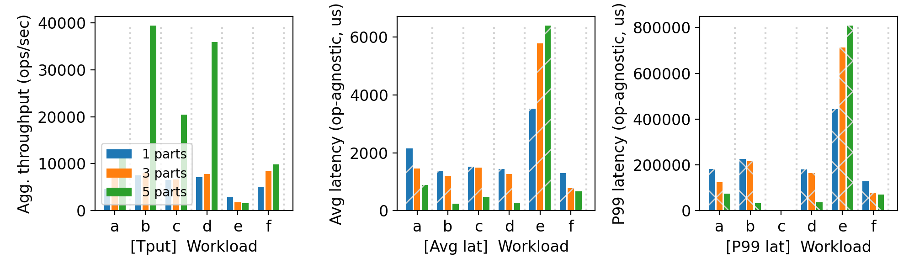
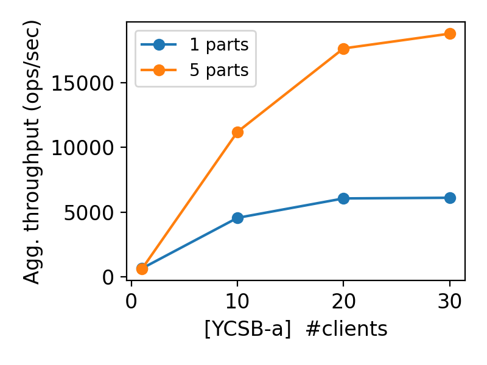

# CS 739 MadKV Project 2

**Group members**: Qiangliang Wu `qwu293@wisc.edu`, Zhenghong Yu `zyu379@wisc.edu`

## 1 Design Walkthrough

### 1.1 Storage Layer Design Walkthrough

Our system introduces two new components: the `Log Manager` and `Storage` service. Initially, we considered a synchronous approach between the in-memory database and storage. However, after analyzing the requirements for P3, we decided to implement a log-based approach. This design decision also allowed us to make the storage service asynchronous while maintaining data durability.

#### 1.1.1 Storage Architecture

The storage layer is positioned at the bottom of our processing stack, working with the in-memory database (by accepting storage request).

#### 1.1.2 Normal Operation Flow
   - Client sends a request through the Gateway
   - Executor processes the request and grant necessary locks
   - For write requests (PUT, SWAP, DELETE), the request is sent to the Log Manager
   - Log Manager synchronously persists these logs to disk
   - After logging, the request is forwarded to the in-memory database
   - In-memory database response back, also asynchronously sends storage messages to the Storage service
   - Storage collects these messages in batches 
   - Batch writing to disk occurs when either:
     - A configured timeout period is reached, or
     - A specified batch size threshold is met

#### 1.1.3 Recovery Process

When the system starts or recovers after a failure:
   - Storage service is initialized first
   - In-memory database service is loaded, reading content from Storage
   - Log Manager is started last
   - Log Manager checks for any non-persisted logs (operations that were logged but may not have reached storage)
   - Any found logs are replayed by sending them to the in-memory database
   - These operations flow through to Storage, ensuring consistency
   - Once the recovery process completes, the system resumes normal operation

#### 1.1.4 Design Benefits

By using logs as the primary durability mechanism, we gain several advantages:
- The in-memory database can operate at high speed without waiting for storage
- Storage can batch operations for efficiency without compromising durability
- The system can recover reliably after failures by replaying logs

### 1.2 Partitioning Design Walkthrough

Our system implements a key-based partitioning strategy to distribute data across multiple partitions. 

#### 1.2.1 Manager Component
We introduced a central Manager component that:
- Knows the total number of available servers and key range at system initialization
- Decides how to partition the key space across servers
- Accepts server registrations to track available partition servers
- Handles client connection requests and provides partition mapping information

#### 1.2.2 Partitioning Strategy

Our partitioning approach is straightforward:
- Keys are distributed based on numeric ranges
- Each partition is assigned keys according to a simple division: `key_num / num_partitions`
- Multiple tables are supported with different key partitioning schemes

#### 1.2.3 Client-Side Interaction

The client interaction with the partitioned system follows these steps:
- Clients initially connect to the Manager to discover partition mapping
- After learning the partition layout, clients send requests directly to the appropriate partition server based on the key
- For SCAN that may span multiple partitions:
   - The operation is carefully divided into multiple command requests
   - Each request is sent to the relevant partition server
   - Results are aggregated on the client side

### 1.3 Retry Logic Design Walkthrough

Our system implements various retry mechanisms to handle connection failures and ensure reliable operation. 

#### 1.3.1 Client-Side Retry Logic
We enable clients to handle connection failures:
- **Manager Connection Retry**: If a client fails to connect to the Manager, it will automatically retry the connection every 1 second
- **Server Connection Retry**: When an RPC channel to a partition server breaks, the client will attempt to re-establish the connection every 1 second
- **Command Tracking**: Clients maintain responsibility for tracking command execution status, enable to retry failed commands when necessary

#### 1.3.2 Server-Side Retry Logic

On the server side, we implement more focused retry logic:

- **Manager Registration Retry**: When a server starts up or recovers, it will retry connecting to the Manager during registration if initial attempts fail
- **No Response Retry**: If a server fails to send results back to a client due to a broken pipe, it simply discards the result

## Self-provided Testcase

You will run the described testcase during demo time.

### Explanations

This self-provided testcase is designed to test the system's ability to handle server failures and recoveries. From the output, we can see that the server 0 and 2 are working well during the server 1 is down. After the server 1 is recovered, the system can resume normal operation, and the server 1 can properly recover from the previous logs.

## Fuzz Testing

<u>Parsed the following fuzz testing results:</u>

num_servers | crashing | outcome
:-: | :-: | :-:
3 | no | PASSED
3 | yes | PASSED
5 | yes | PASSED

You will run a crashing/recovering fuzz test during demo time.

### Comments

- Test1: Concurrency:
    - Demonstrated the system works well under concurrency.
- Test2, Test3: Concurrency with Failures:
    - Test with server crashes and recoveries.
    - Demonstrated the system works well under concurrency even with server failures.

## YCSB Benchmarking

<u>10 clients throughput/latency across workloads & number of partitions:</u>

<u>Agg. throughput trend vs. number of clients w/ and w/o partitioning:</u>

### Comments

<u>10 clients throughput/latency across workloads & number of partitions:</u>

The throughput graph shows significant improvements with increased partitioning, particularly for single read/write-heavy workloads (B - 95% writes, D - 95% reads, 5% scans). Workload B shows the most dramatic improvement with 5 partitions reaching nearly 40,000 ops/sec, which indicates our partitioning strategy effectively distributes write operations across servers.

Average latency consistently decreases as partition count increases. The improvement is pronounced in most of the workloads. With 5 partitions, we see latency reductions of up to 75% compared to a single partition, showing that distributing the request reduces contention and improves response times. 

Workload E (95% scan, 5% read), however, shows increased latency because scan operations require distributing reads to all partitions. This introduces coordination overhead and result combination overhead (since we need to reorder results when received). We also encountered problems in workload E with sparse hash keys in large key spaces. To address this, we made a design trade-off to bypass the lock manager for SCAN operations, sacrificing some consistency for better performance.

Tail latencies follow similar patterns to average latency, with the 5-partition configuration providing significant improvements across most of workloads. Workload E (95% scans, 5% inserts) shows the highest P99 latency, also have worse performance with higher partitions. 

<u>Agg. throughput trend vs. number of clients w/ and w/o partitioning:</u>

This graph clearly shows our system's scalability advantages with partitioning. While the single-partition configuration plateaus at around 6,000 ops/sec regardless of client count, the 5-partition system continues scaling linearly, reaching nearly 19,000 ops/sec with 30 clients on workload A (50% reads/50% writes). This shows that our partitioning strategy effectively eliminates bottlenecks and enables horizontal scaling as demand increases.

## Additional Discussion

*OPTIONAL: add extra discussions if applicable*

