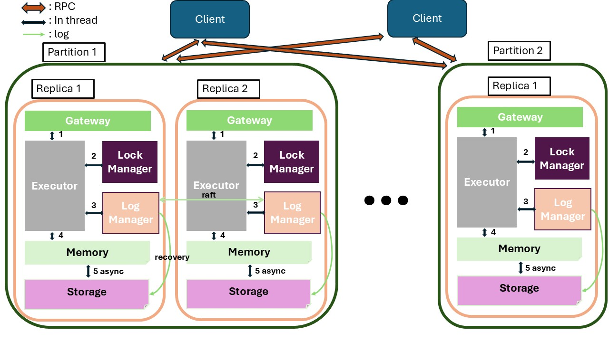
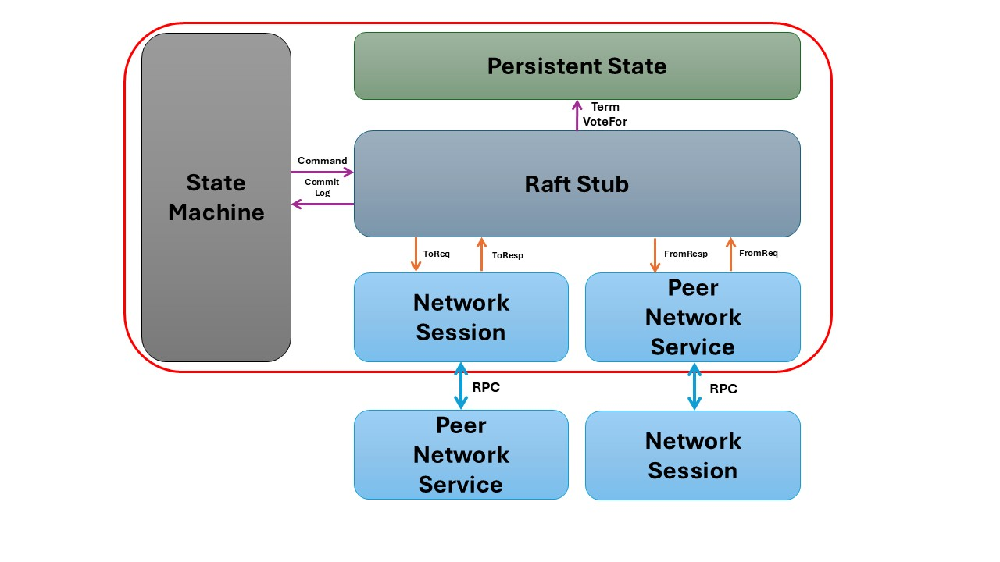
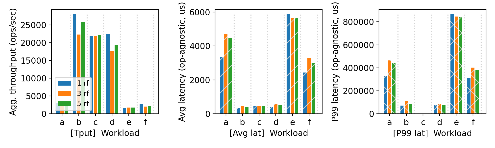
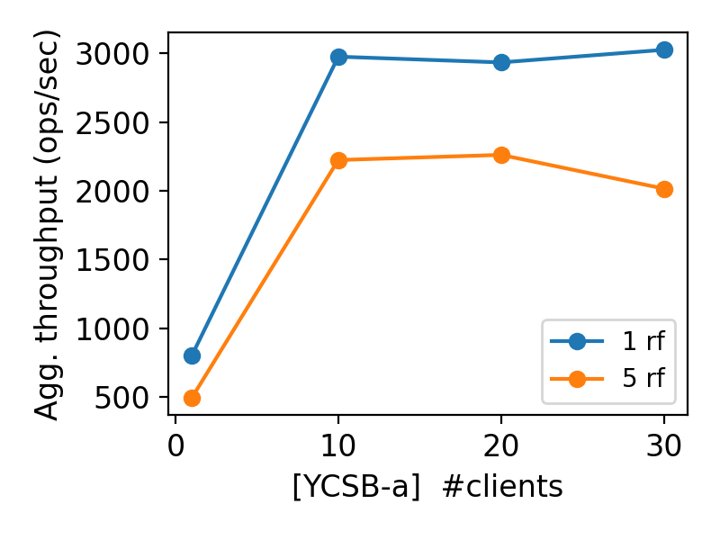

# CS 739 MadKV Project 3

**Group members**: Qiangliang Wu `qwu293@wisc.edu`, Zhenghong Yu `zyu379@wisc.edu`

## 1 Design Walkthrough

### 1.1 KV Store Structure Design

In our architecture, consensus features are segregated within the Log Manager component. At a high level, when a node operates as the leader, it first attempts to acquire all necessary locks for a given command. Once successful, it then propagates write operations (PUT/DELETE/SWAP) through the Raft consensus protocol within the Log Manager. After receiving confirmation that the command has been committed across the cluster, the operation is forwarded to the database for execution.

### 1.2 Raft Component Design

At a high level, our Raft implementation consists of three core components. The Raft stub is integrated within the Log Manager and provides the necessary interface for consensus operations. The Raft network session is operating in a dedicated thread, responsible for transmitting requests (AppendEntries/RequestVote) to other nodes and collecting their responses. Similarly, the Raft network service runs in its own separate thread, listening for incoming requests from other nodes, forwarding them to the Raft stub for processing, and then returning responses back to the originating nodes.

The system utilizes three distinct types of inter-thread communication channels: BroadcastAppendEntries for transmitting heartbeats (which may also contain commands), CatchupAppendEntries for synchronizing stale followers with current state, and BroadcastRequest for initiating leader election voting processes.

#### 1.2.1 Raft Stub

The Raft Stub functions as a comprehensive state machine with three distinct internal states: Leader, Follower, and Candidate. It operates within an infinite loop, continuously monitoring inter-thread communication channels. The stub processes messages from the network session, which can trigger internal state transitions and generate appropriate responses. Additionally, it responds to timing events (such as leader heartbeats and follower election timeouts) by instructing the network session to dispatch necessary requests to other nodes.

#### 1.2.2 Raft Network Session

The Raft Network Session monitors three communication channels from raft stub with distinct handling patterns: for BroadcastAppendEntries, it distributes messages to all peer nodes and awaits responses from a majority; for CatchupAppendEntries, it targets a specific node and processes a single response; and for BroadcastVote, it disseminates election requests to all peer nodes and requires majority consensus before proceeding.

#### 1.2.3 Raft Network Service

The Raft Network Service continuously monitors for RPC requests from all peer nodes and forwards these requests to the Raft stub for processing. Upon receiving the corresponding responses from the Raft stub, it relays them back to the original requesting peers.

## 2 Self-provided Testcases

You will run the four described testcase scenarios during demo time.

### 2.1 Explanations

This self-provided testcase is designed to test the system's ability to handle server failures and recoveries. 

1. Fail <f follower nodes, our system can continue operating
2. Fail leader nodes, our system can continue operating
3. Fail >=f follower/leader nodes, our system will hang clients request. 

## 3 Fuzz Testing

<u>Parsed the following fuzz testing results:</u>

server_rf | crashing | outcome
:-: | :-: | :-:
5 | no | PASSED
5 | yes | PASSED

You may be asked to run a crashing fuzz test during demo time.

### 3.1 Comments

- Test1: Without Crashing:
    - Verified system functionality in a non-failure environment, where election triggers are rare due to consistent node availability.
- Test2: With Crashing:
    - Evaluated performance during server crashes and recovery scenarios.
    - Confirmed system reliability under concurrent operations even when experiencing intermittent server failures.

## 4 YCSB Benchmarking

<u>10 clients throughput/latency across workloads & replication factors:</u>

<u>Agg. throughput trend vs. number of clients with different replication factors:</u>

### 4.1 Comments

<u>10 clients throughput/latency across workloads & number of partitions:</u>

Our throughput testing reveals distinct performance patterns across workload types. Write-heavy workloads (particularly B with 95% writes) show notable limitations, with 5-replica configurations for workloads A, E, and F reaching approximately 1500 operations per second due to the required Raft consensus processing and resulting network latency. In contrast, read-heavy workloads perform substantially better since our architecture processes read outside the consensus pathway, eliminating both Raft consensus requirements and read logging for optimized performance in read-dominant scenarios. Meanwhile, we do not observe significant influence caused by increasing replica count, as all nodes demonstrate similar response times.

Average latency consistently follows the same pattern as throughput, and we do not observe any other interesting results across our test configurations.

Tail latencies follow similar patterns to average latency; however, workload C achieves notably superior performance due to its 100% read operation profile, allowing it to benefit from our consensus-bypass optimizations for read operations fully.

<u>Agg. throughput trend vs. number of clients w/ and w/o partitioning:</u>

Our analysis reveals limited scalability advantages with replication in our system. Performance metrics indicate that the system reaches a bottleneck at eight concurrent clients. Even with single-replica configurations, we maintained Raft protocol functionality where the node votes for itself and maintains heartbeat timing. We identified two primary bottlenecks: first, the leader node where log management and Raft processes reach nearly 100% CPU utilization; second, disk operations, particularly the critical path random disk writes, which include both synchronized log writing and more complex operations like log truncation and commit bit management.

Performance remains relatively stable as the replica count increases from 1 to 5, with minimal degradation observed across this range. This resilience is particularly evident when comparing 3-replica and 5-replica configurations, which show negligible performance differences. This consistency can be attributed to our symmetric node architecture, where processing capabilities and response times remain uniform across all nodes in the cluster.

## Additional Discussion

Our initial Raft implementation faced significant performance bottlenecks. We processed all Raft requests through `tokio::async` runtime. This resulted in leader nodes quickly reaching 100% CPU utilization and throughput degrading to 2-3 operations per second. This bottleneck stemmed from excessive recursive `tokio::spawn{async move}` calls, where Tokio's behavior caused both Raft stub and network session components to compete for the same CPU resources.

To address these limitations, we redesigned our architecture to isolate the Raft network session on a separate CPU during initialization. This separation allows the network component to handle request transmission and response reception independently without interfering with other processes. The redesign enables the Raft stub to operate as a truly asynchronous method, simply placing requests into an inter-thread channel before continuing its work, eventually returning responses from the network session.

This approach maintains operational safety through the first-in-first-out property of inter-thread channels. The Raft network session processes non-communicative requests in the exact sequence they were triggered by the Raft stub, ensuring that responses are appropriately matched to their corresponding requests and maintaining the consistency guarantees required by the Raft protocol.

